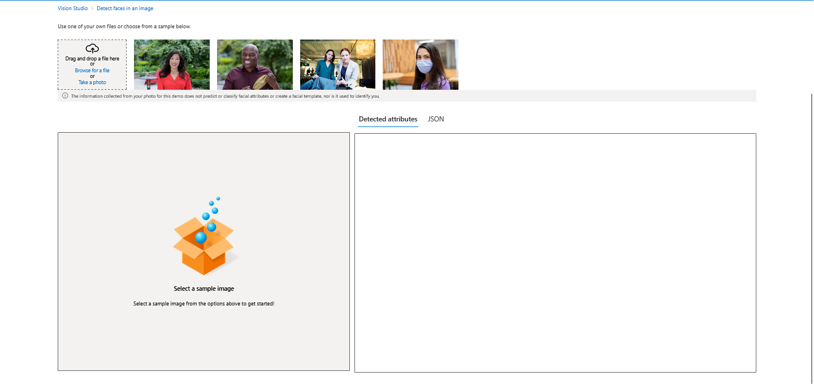
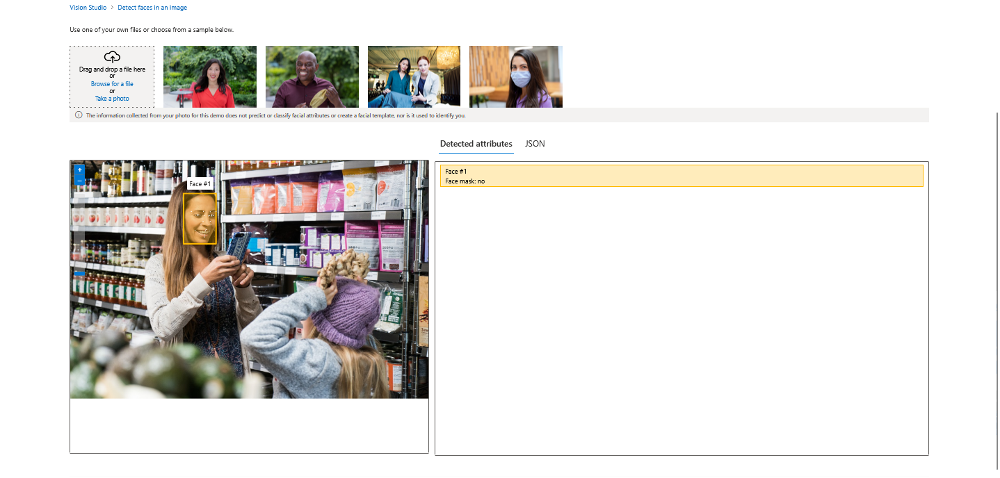
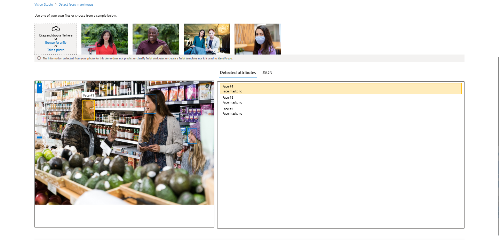
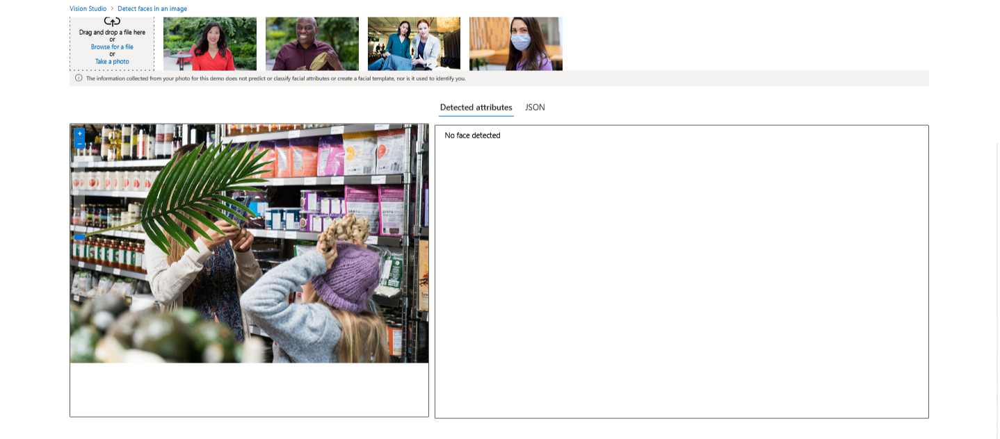
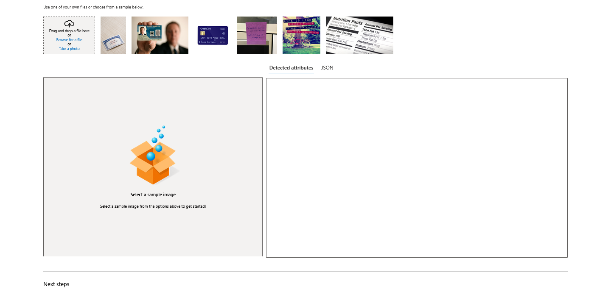
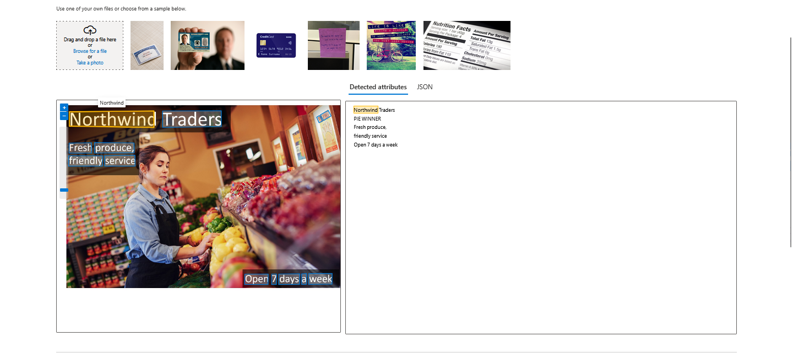
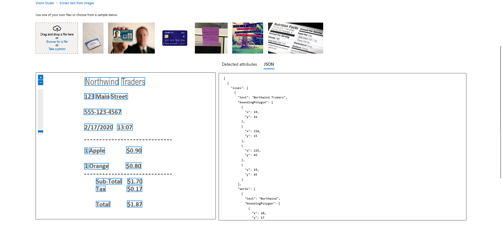
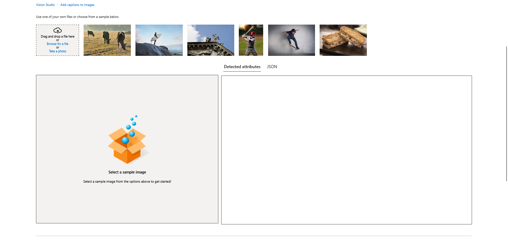
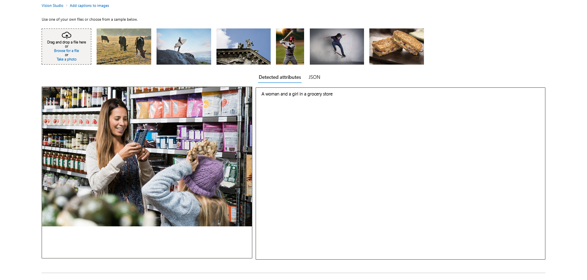
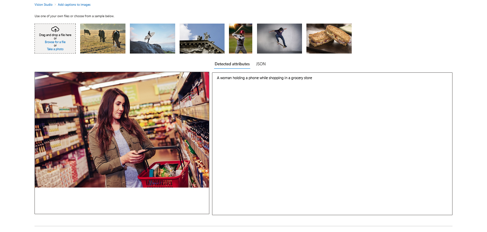

# Azure Vision Studio

> Challenge created as part of the Microsoft AI Fundamentals Bootcamp by DIO, based on the tutorials:

- [Detect faces in Vision Studio](https://aka.ms/ai900-face)
- [Read text in Vision Studio](https://aka.ms/ai900-ocr)
- [Analyze images in Vision Studio](https://aka.ms/ai900-image-analysis)

## 1. Detect Faces in Vision Studio

<details>

  <summary>

### 1.1. Provision an Azure AI services resource

  </summary>

- Start by provisioning an Azure AI services in the Azure portal.

- Search for "Azure AI services" in the Azure portal and create a new Azure AI services resource.

</details>

<details>
  <summary>

### 1.2. Connect Azure AI service resource to Vision Studio

  </summary>

- Navigate to [Vision Studio](https://portal.vision.cognitive.azure.com).

- On the Getting started with Vision landing page, select the **Face** tab and then select the **Detect Faces** in an image tile.

- Under the Try It Out subheading, acknowledge the resource usage policy by reading and checking the box.

 
<div align="center">Vision Studio Interface - Detect Faces</div>

</details>

<details>
  <summary>

### 1.3. Upload the images

  </summary>

- The following images can be found in the folder <a href= './inputs/detect-faces'>detect-faces</a>.


<div align="center">Image 01</div>
<br />

 
<div align="center">Image 02</div>
<br />

 
<div align="center">Image 03</div>

</details>

<details>
  <summary>

### 1.4. Outputs

  </summary>


<div align="center">Results - Image 01</div>
<br />

> JSON attributes generated <a href= './output/detect-faces/image01-attributes.json'>here</a>.

<br />


<div align="center">Results - Image 02</div>
<br />

> JSON attributes generated <a href= './output/detect-faces/image02-attributes.json'>here</a>.

<br />


<div align="center">Results - Image 03</div>

</details>

## 2. Read text in Vision Studio

<details>
  <summary>
  
### 2.1. Navigate to Vision Studio
  
  </summary>

- Navigate to [Vision Studio](https://portal.vision.cognitive.azure.com).

- On the Getting started with Vision landing page, **Optical character recognition**, and then the **Extract text from images tile**.

- Under the Try It Out subheading, acknowledge the resource usage policy by reading and checking the box.



<div align="center">Vision Studio Interface - OCR</div>
</details>

<details>
  <summary>
  
### 2.2. Upload the images
  
  </summary>

- The following images can be found in the folder <a href= './inputs/read-text-ocr'>read-text-ocr</a>.


<div align="center">Image 01</div>
<br />

<div align="center"> 
     
</div>

<div align="center">Image 02</div>

</details>

<details>
  <summary>

### 2.3. Outputs

  </summary>


<div align="center">Results - Image 01</div>
<br />

> Extracted Text:

```
NorthwindTraders
PIEWINNER
Freshproduce,
friendlyservice
Open7daysaweek

```

> JSON attributes generated <a href= './output/read-text-ocr/image01-attributes.json'>here</a>.

<br />


<div align="center">Results - Image 02</div>
<br />

> Extracted Text:

```
NorthwindTraders
123MainStreet
555-123-4567
2/17/202013:07
1Apple
$0.90
1Orange
$0.80
Sub-Total
$1.70
Tax
$0.17
Total
$1.87

```

> JSON attributes generated <a href= './output/read-text-ocr/image02-attributes.json'>here</a>.

</details>

## 3. Analyze images in Visual Studio

<details>
  <summary>
  
### 3.1. Navigate to Vision Studio
  
  </summary>

- Navigate to [Vision Studio](https://portal.vision.cognitive.azure.com).

- On the Getting started with Vision landing page, **Image analysis**, and then the **Add captions to images**.

- Under the Try It Out subheading, acknowledge the resource usage policy by reading and checking the box.

 
<div align="center">Vision Studio Interface - Image Analysis</div>

</details>

<details>
  <summary>
  
  ### 3.2. Upload the images
  
  </summary>

- The following images can be found in the folder <a href= './inputs/analyze-images'>analyze-images</a>.


<div align="center">Image 01</div>
<br />

<div align="center"> 
     
</div>

<div align="center">Image 02</div>

</details>

<details>
  <summary>

### 3.3. Outputs

  </summary>


<div align="center">Results - Image 01</div>
<br />

> Caption: A woman and a girl in a grocery store

> JSON attributes generated <a href= "./output/analyze-images/store-camera-1-attributes.json">here</a>.

<br />


<div align="center">Results - Image 02</div>
<br />

> Caption: A woman holding a phone while shopping in a grocery store

> JSON attributes generated <a href= "./output/analyze-images/store-camera-2-attributes.json">here</a>.

</details>
